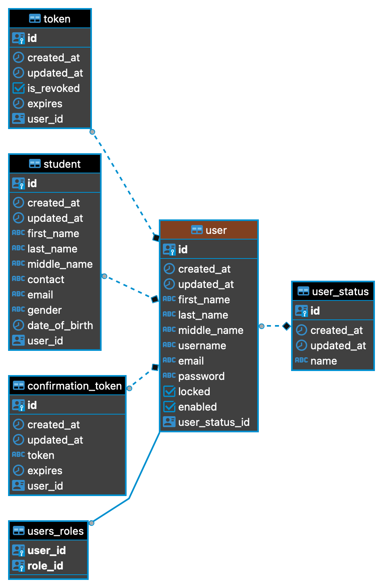
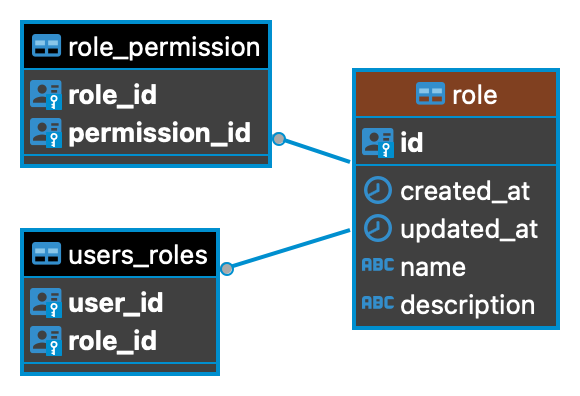
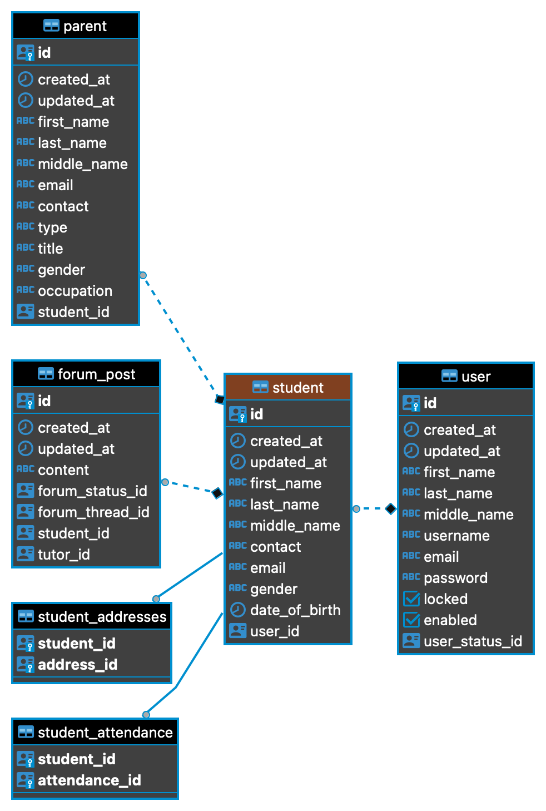
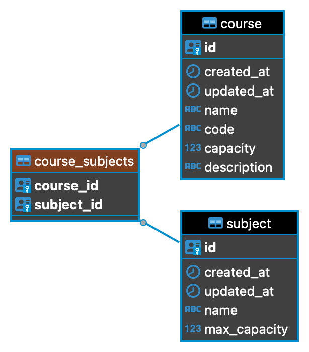
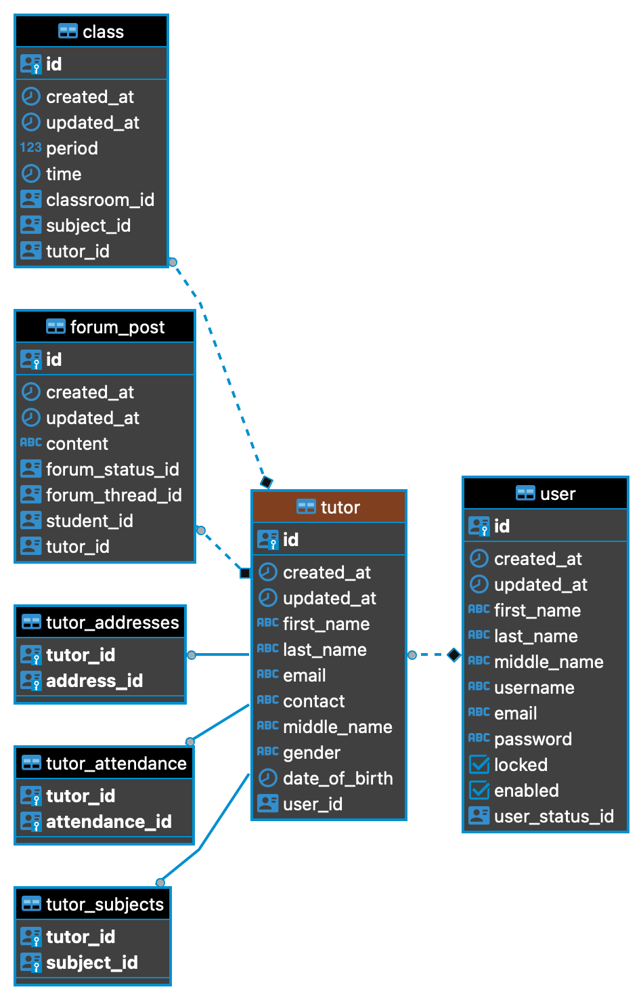

# SMS_Service ![Node.js CI]

# Functional Requirement (Russian)

## 4.4.1.1 Admin (Headmaster)
- Create, edit and delete student account.
- Create, edit and delete tutor account.
- Create, edit and delete parent account.
- Post tasks or any updates for users (Tutor, Student, and Parent).
- Store, edit, delete, calculate and print student's grade.
- Add Classes and Subject and connect them with the subject’s tutors.

## 4.4.1.2 Tutor
- Enter Student's grades per Subject.
- Contact with students and parents.
- Post tasks or any updates for users (Admin, Student, and Parent).

## 4.4.1.3 Student
- View their grades.
- Contact with their tutor and headmaster.

## 4.4.1.4 Parent
- View the grades of their children.
- Contact with their children’s teachers and headmaster.

---

## 5.4.2 Database Schema (Russian)

### User
User Schema 

### Role
Role Schema 

### Student
Student Schema 

### Course-Subjects
Course-Subjects 

### Tutor
Tutor 

# Funksional talablar (O'zbekcha)

## 4.4.1.1 Administrator (Direktor)
- Talaba hisobini yaratish, tahrirlash va o‘chirish.
- O‘qituvchi hisobini yaratish, tahrirlash va o‘chirish.
- Ota-ona hisobini yaratish, tahrirlash va o‘chirish.
- Foydalanuvchilar (o‘qituvchi, talaba va ota-onalar) uchun topshiriqlar yoki yangilanishlarni joylash.
- Talabaning baholarini saqlash, tahrirlash, o‘chirish, hisoblash va chop etish.
- Sinflar va fanlarni qo‘shish hamda ularni tegishli o‘qituvchilar bilan bog‘lash.

## 4.4.1.2 O‘qituvchi
- Har bir fan bo‘yicha talabalarning baholarini kiritish.
- Talabalar va ota-onalar bilan bog‘lanish.
- Administrator, talaba va ota-onalar uchun yangiliklar yoki topshiriqlar joylash.

## 4.4.1.3 Talaba
- O‘z baholarini ko‘rish.
- O‘qituvchi va direktor bilan bog‘lanish.

## 4.4.1.4 Ota-ona
- Farzandlarining baholarini ko‘rish.
- Farzandlarining o‘qituvchilari va direktor bilan bog‘lanish.

---

## 5.4.2 Ma’lumotlar bazasi sxemasi (O'zbekcha)

### User
Foydalanuvchi sxemasi 

### Role
Rol sxemasi 

### Student
Talaba sxemasi 

### Course-Subjects
Kurs-fanlar sxemasi 

### Tutor
O‘qituvchi sxemasi 